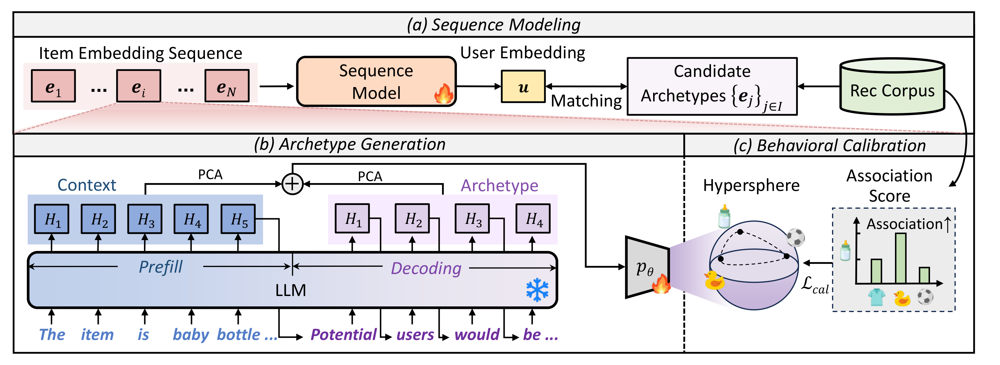

# Generative Archetype-Grounded Item Representations for Sequential Recommendation (GenAIR)

This is the implementation for **GenAIR** proposed in our paper:

> **[Generative Archetype-Grounded Item Representations for Sequential Recommendation](https://dl.acm.org/doi/abs/10.1145/3774904.3792587)**  
> Yifan Li, Jiahong Liu, Xinni Zhang, Hao Chen, Yankai Chen, Wenhao Yu, Jianting Chen, Irwin King  
> _The ACM Web Conference 2026 (**WWW 2026, Oral**)_



## 📚 Download Dataset

We evaluate GenAIR on three public benchmarks. Please download the raw archives from the official sources below and place them under
`data/<dataset>/raw/`:

- [Yelp Dataset](https://www.yelp.com/dataset)
- [Fashion and Beauty Dataset](https://cseweb.ucsd.edu/~jmcauley/datasets.html#amazon_reviews)

## 📝 Setup

Install dependencies in the GPU environment:

```bash
pip install -r requirements.txt
```

## 📁 Expected Data Layout

```text
data/
  beauty/
    raw/       # raw archive downloaded from the official source
    handled/   # preprocessed files consumed by the training code
  fashion/
    raw/
    handled/
  yelp/
    raw/
    handled/
```

Most paths are relative to the repository root, so run scripts from there
unless noted otherwise.

## Data Preparation

### 1. Raw Data Preprocessing

```bash
python data/data_process.py
```

The script uses the dataset configured in `data/data_process.py` and writes
the handled files under `data/<dataset>/handled/`.

### 2. Interaction Pair Conversion

Run `data/convert_inter.ipynb` from the `data/` directory. Set the
`dataset` variable in the notebook to `beauty`, `fashion`, or `yelp`.

### 3. Co-occurrence Preprocessing

Run `getCo-occer.ipynb` from the `data/` directory. Set `DATASET` in the
notebook to the target dataset.

### 4. Item Prompt Construction

Run `data/item_prompt.ipynb` for the target dataset. The notebook reads
`handled/item2attributes.json`, so run it with the working directory set
to `data/<dataset>/`.

### 5. LLM Embedding Extraction

Run `data/getEmb.py` from the target dataset's handled directory:

```bash
cd data/<dataset>/handled
export LLM_MODEL_PATH=/path/to/your/llm
export LLM_ITEM_TYPE="item"
python ../../getEmb.py
```

### 6. Pooling, Concatenation, and Visualization

Run `pooling_and_concat.ipynb` after `getEmb.py` from the `data/` directory.
If needed, point the notebook to the handled directory:

```bash
export LLM_EMB_RESULT_DIR=./<dataset>/handled
```

Use `item_pca384_concat768.pkl` as the final LLM embedding file for
training.

## 🚀 Training

Each dataset has its own launch script that runs the three backbones
(SASRec, BERT4Rec, GRU4Rec) with fixed hyper-parameters:

```bash
# Fashion
bash experiments/fashion.bash

# Yelp
bash experiments/yelp.bash

# Beauty
bash experiments/beauty.bash
```

The launch scripts set the dataset-specific LLM embedding and co-occurrence
paths by default.

Checkpoints are written under `./saved/`. The `--log` flag (already set
inside the bash scripts) persists the per-run training log to a separate
file for later inspection.

## 🌟 Citation

If you find this repository useful in your research, please consider
citing our paper:

```bibtex
@inproceedings{li2026generative,
  title={Generative Archetype-Grounded Item Representations for Sequential Recommendation},
  author={Li, Yifan and Liu, Jiahong and Zhang, Xinni and Chen, Hao and Chen, Yankai and Yu, Wenhao and Chen, Jianting and King, Irwin},
  booktitle={Proceedings of the ACM Web Conference 2026},
  pages={6642--6653},
  year={2026}
}
```

## Acknowledgement

The codebase has referred to [LLMEmb](https://github.com/liuqidong07/LLMEmb). Many thanks!


